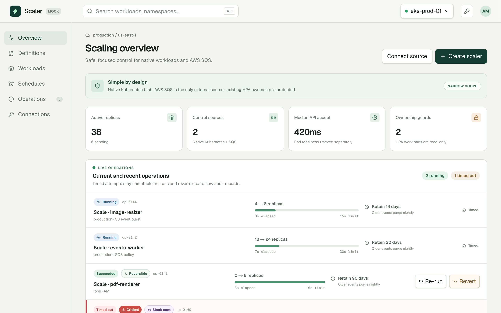
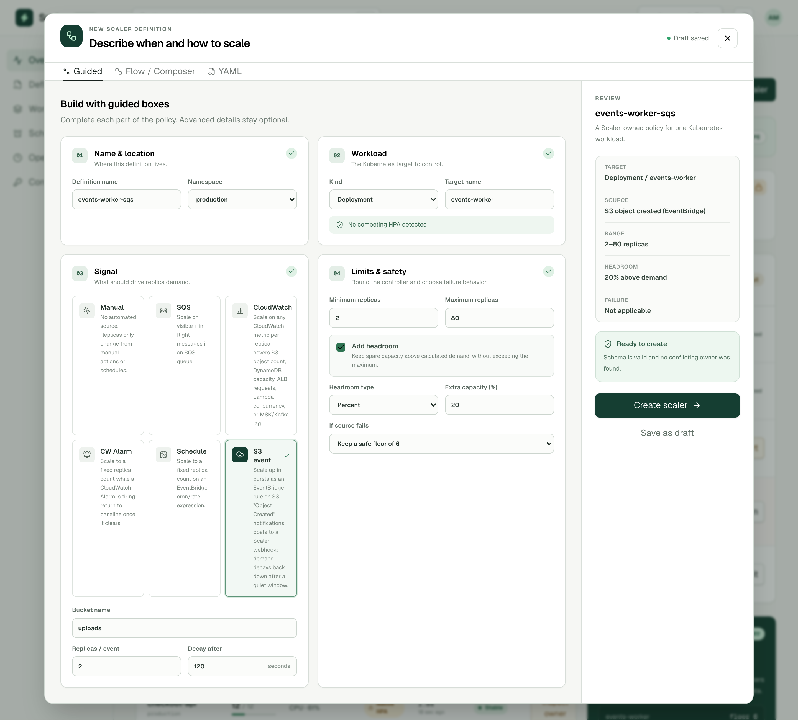
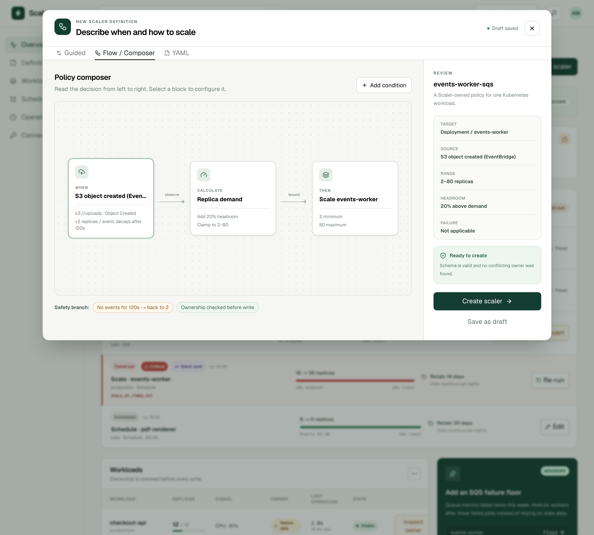
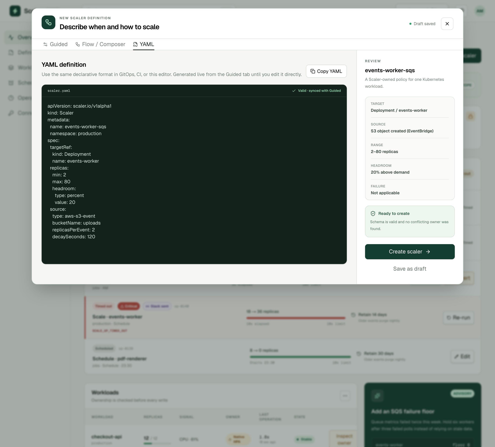
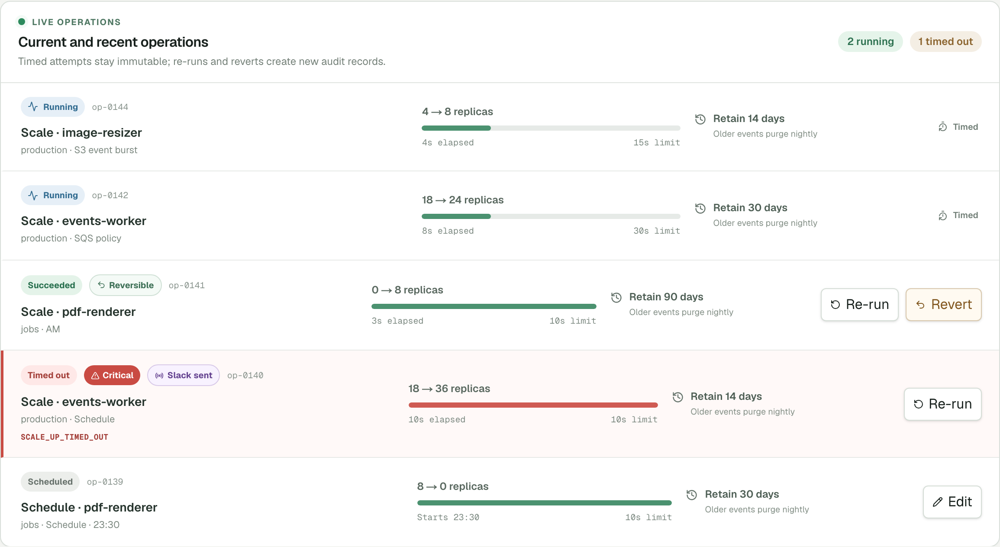

# Scaler UI mock

A deliberately narrow Kubernetes scaling control plane for teams that need safe manual changes, schedules, and a first-class AWS SQS policy without adopting a general-purpose event-driven autoscaling platform.

## Screenshots

**Scaling overview** — live operations, workload ownership, and advisory suggestions in one view.



**Trigger catalog** — the Guided tab's Signal step, showing the full source catalog (SQS, CloudWatch metric/alarm, EventBridge schedule, S3 object-created) with the S3 push trigger selected.



**Flow / Composer** and **YAML** tabs stay in sync with the same Guided selection — the same S3 trigger shown left-to-right as a policy, and as the declarative `scaler.io/v1alpha1` contract.




**Operations** — timed, auditable scale attempts with critical detection and Slack delivery status.



## Quick install

From the repository root, choose one installer. Each one-liner creates random database and event API credentials with `openssl` and installs into the `scaler` namespace.

**Helm**

```bash
helm upgrade --install scaler ./deploy/helm/scaler --namespace scaler --create-namespace --set-string secrets.databasePassword="$(openssl rand -hex 24)" --set-string secrets.eventsToken="$(openssl rand -hex 32)"
```

**kubectl**

```bash
sed -e "s/DATABASE_PASSWORD: \"CHANGE_ME\"/DATABASE_PASSWORD: \"$(openssl rand -hex 24)\"/" -e "s/SCALER_EVENTS_TOKEN: \"CHANGE_ME\"/SCALER_EVENTS_TOKEN: \"$(openssl rand -hex 32)\"/" deploy/scaler.yaml | kubectl apply -f -
```

**Kustomize**

```bash
kustomize build deploy | sed -e "s/DATABASE_PASSWORD: \"CHANGE_ME\"/DATABASE_PASSWORD: \"$(openssl rand -hex 24)\"/" -e "s/SCALER_EVENTS_TOKEN: \"CHANGE_ME\"/SCALER_EVENTS_TOKEN: \"$(openssl rand -hex 32)\"/" | kubectl apply -f -
```

These defaults use the EKS EBS CSI `gp3` storage class, a bundled in-cluster Postgres, and the `236565801201.dkr.ecr.eu-central-1.amazonaws.com/scaler:latest` image. For production, use a private Helm values file or external secret manager, pin an image tag, configure IRSA or EKS Pod Identity, set `secrets.slackWebhookUrl` if Slack alerts are required, and consider [Amazon RDS instead of the bundled Postgres](#using-amazon-rds-instead-of-in-cluster-postgres).

## Product premise: simpler on purpose

Scaler is not intended to reproduce KEDA or become a universal metrics adapter. Its premise is that a focused controller can be easier to understand and operate when the supported problem is intentionally small.

The design follows these rules:

- **Use Kubernetes primitives first.** Scaler writes through the workload `/scale` subresource and observes native HPA instead of replacing it.
- **Never create two owners.** A workload already controlled by HPA, KEDA, or another reconciler is read-only until an explicit ownership transfer is reviewed.
- **Support fewer sources well.** The first external policy is AWS SQS on EKS. New sources should be added only with a concrete production need.
- **Keep recommendations advisory.** Suggestions create a reviewable draft; they never change cluster state silently.
- **Separate request time from readiness time.** API acceptance, replica creation, scheduling, and application readiness are reported independently. Scaler does not promise one-second end-to-end scaling.
- **Fail safely and visibly.** Source failures use an explicit per-workload policy such as hold-current or a configured replica floor, and every decision is recorded.

## Product features

### Define a scaler three ways

Scaler definitions are not intended to be GUI-only. The authoring workspace exposes the same policy in three forms:

- **Guided:** structured boxes for the definition, workload, signal, and safety limits;
- **Flow / Composer:** a left-to-right view of signal, demand calculation, and scale action;
- **YAML:** the declarative `scaler.io/v1alpha1` contract for GitOps and CI workflows.

Each definition can reserve optional headroom above calculated demand, expressed as a percentage or a fixed replica count. Headroom is applied before the configured maximum replica limit.

Example percentage-based headroom:

```yaml
apiVersion: scaler.io/v1alpha1
kind: Scaler
metadata:
  name: events-worker-sqs
  namespace: production
spec:
  targetRef:
    kind: Deployment
    name: events-worker
  replicas:
    min: 2
    max: 80
    headroom:
      type: percent
      value: 20
```

For fixed capacity, use `type: replicas`. The controller first calculates source demand, adds the configured headroom, and finally clamps the result to the `min`/`max` range. Headroom belongs to each Scaler definition and does not change any other workload policy.

The interactive dashboard still demonstrates this contract with mock data. Reconciliation of real definitions — reading a source, applying the ownership guard, and writing the `/scale` subresource — runs in the `reconciler` container described under [Deploy to Kubernetes](#deploy-to-kubernetes), independently of the UI.

### Trigger catalog

A Scaler definition's `source.type` selects one of these triggers. Every entry ends up as a bounded replica count through the same headroom → min/max pipeline described above; only how the raw demand number is produced differs.

| Type                       | Mode     | Demand comes from                                                                                                                                                                                                                                                         |
| -------------------------- | -------- | ------------------------------------------------------------------------------------------------------------------------------------------------------------------------------------------------------------------------------------------------------------------------- |
| `manual`                   | —        | No automated source; only manual actions and schedules change replicas.                                                                                                                                                                                                   |
| `aws-sqs`                  | poll     | `ApproximateNumberOfMessages` + `…NotVisible` on an SQS queue, divided by `targetMessagesPerReplica`.                                                                                                                                                                     |
| `aws-cloudwatch-metric`    | poll     | Any CloudWatch metric value divided by `targetValuePerReplica` — this one entry covers S3 bucket size/object count, DynamoDB consumed capacity, ALB request count, Lambda concurrency, and MSK/Kafka consumer lag, since AWS publishes all of them as CloudWatch metrics. |
| `aws-cloudwatch-alarm`     | alarm    | A fixed `alarmReplicas` while the named CloudWatch Alarm is in `ALARM` state; the definition's `min` otherwise.                                                                                                                                                           |
| `aws-eventbridge-schedule` | schedule | A fixed `scheduledReplicas` on a cron/rate expression. This is a declarative contract only for now — the dedicated Schedules feature evaluates it, not the reconciler's poll loop, so a cron parser doesn't have to live in two places.                                   |
| `aws-s3-event`             | push     | An EventBridge rule on S3 "Object Created" (or any other push source) posts to `POST /v1/webhooks/push/:namespace/:name`; each call adds `replicasPerEvent` to demand, decaying back to the baseline after `decaySeconds` of silence.                                     |

`GET /v1/triggers` returns this catalog (fields and descriptions) from the running events API, so a UI or CLI can build a form without hardcoding it. See [`controller/triggers.mjs`](controller/triggers.mjs) for the exact field validation and [`controller/reconciler.mjs`](controller/reconciler.mjs) for how each mode is polled.

### Initial scope

- discover Deployments, StatefulSets, native HPAs, and their current owner;
- apply guarded manual changes through the Kubernetes `/scale` subresource;
- reconcile Scaler definitions on a poll loop: ownership guard, source read, headroom, min/max clamp, and a `/scale` write, reported to the events API — see [`controller/reconciler.mjs`](controller/reconciler.mjs);
- pause Scaler-owned automation for a bounded manual-override window;
- run timezone-aware replica schedules;
- scale EKS consumers from AWS SQS queue depth, CloudWatch metrics or alarms, or S3 event notifications, using IRSA or EKS Pod Identity;
- record requested, accepted, scheduled, ready, timed-out, and failed operation stages;
- set an event-retention period per scale job and purge expired events nightly;
- show advisory recommendations and ownership-transfer plans for review.

### Suggested next features

- evaluate `aws-eventbridge-schedule` definitions against the Schedules feature instead of leaving them declarative-only;
- stale-metric detection (a source that keeps succeeding but stops changing);
- leader election, rate limiting, jitter, and idempotent reconciliation for multiple reconciler replicas;
- readiness SLOs based on Pod readiness rather than only the replica field;
- namespace-scoped policy and approval rules;
- Prometheus metrics and Kubernetes audit-log correlation;
- dry-run and rollback plans for schedules and ownership transfers;
- wire the mock UI's "Create scaler" flow to `POST /v1/definitions` instead of local-only state.

### Explicitly out of scope for now

- a generic external-metrics API server;
- dozens of interchangeable trigger providers;
- silently managing workloads owned by HPA or KEDA;
- claiming that a scale request means Pods are ready;
- node provisioning, vertical rightsizing, or application-level concurrency control.

## Development

```bash
npm install
npm run dev              # UI dev server at http://localhost:3000
npm run events            # events API on :3001 (needs a running Postgres)
npm run reconcile         # reconciler control loop (needs Postgres + a Kubernetes API)
npm run test:controller   # controller/**/*.test.mjs — no database or AWS credentials required
npm run lint
npm run format
```

`test:controller` covers demand math, trigger-source validation, definition validation, reconciliation decisions, and the Kubernetes REST client (against a real local HTTP server standing in for kube-proxy) without needing a database, a cluster, or AWS credentials — the AWS SQS/CloudWatch readers and the events API's Postgres queries are exercised through injected mocks and dependency-injected pools rather than live calls.

## Run with Docker

```bash
docker compose up --build
```

Open <http://localhost:3000>. The UI uses realistic mock data; controls are interactive but do not modify a cluster.

That starts the UI plus a local Postgres and the real `events` API (`http://localhost:3001`, see [Scaler definitions API](#scaler-definitions-api) and [Critical logs and Slack notifications](#critical-logs-and-slack-notifications) for what you can do against it). Local-only default credentials come from `compose.yaml`; override `DATABASE_PASSWORD` and `SCALER_EVENTS_TOKEN` with a `.env` file if you want different ones — never reuse these defaults anywhere reachable outside your machine.

The `reconciler` control loop is not part of the default stack, since without a real Kubernetes API and AWS credentials it can only log errors on every pass. Start it explicitly once you have both (see [Local kube-proxy access](#local-kube-proxy-access) and [AWS credentials](#aws-credentials) below):

```bash
docker compose --profile reconciler up
```

### Local development database

The `postgres` service persists to a named Docker volume (`scaler-postgres-data`), initialized from [`deploy/db/001-schema.sql`](deploy/db/001-schema.sql) — the same schema the Kubernetes deployment uses. No host port is published by default (5432 is a common collision with another local Postgres); connect with `docker compose exec postgres psql -U scaler -d scaler`, or publish a port yourself in a `docker-compose.override.yml`.

Two scripts make it low-risk to experiment against real data — reset the stack, try a migration, or just save a known-good state before poking at something:

```bash
npm run db:backup                      # -> backups/scaler-<timestamp>.dump (gitignored)
npm run db:backup -- before-migration  # optional label suffix

npm run db:restore -- backups/scaler-<timestamp>.dump
```

`db:restore` asks for confirmation before it runs (skip with `-- --yes` for scripts/CI) and, by default, takes its own fresh safety backup of the current database _before_ replacing it — so a restore you didn't mean to run is itself one more `db:restore` away from undo. Pass `--no-safety-backup` to skip that if you're restoring into a database you don't care about.

These wrap `pg_dump`/`pg_restore` through `docker compose exec`, so they only work against the local Compose Postgres. For an in-cluster or RDS database, see [`deploy/migrations/README.md`](deploy/migrations/README.md) for the equivalent `kubectl exec`/`psql` commands, or use RDS automated snapshots (see below).

## Local kube-proxy access

```bash
kubectl proxy --port=8001
```

The Compose setup exposes it to the UI container as `http://host.docker.internal:8001`. Keep this local; do not publish the proxy through an ingress.

## AWS credentials

The deployment is designed for three credential modes:

1. **EKS node credentials:** use the worker instance profile (`AWS_CREDENTIAL_MODE=node`). Simple, but pods on the node may share the role's reach.
2. **OIDC / IRSA (recommended):** create a least-privilege IAM role and attach it to the `scaler` service account.
3. **Static keys for local development only:** pass `AWS_ACCESS_KEY_ID`, `AWS_SECRET_ACCESS_KEY`, and optionally `AWS_SESSION_TOKEN` as runtime secrets. Never add them to the image or repository.

Example IRSA attachment:

```bash
eksctl create iamserviceaccount \
  --cluster my-cluster \
  --namespace scaler \
  --name scaler \
  --attach-role-arn arn:aws:iam::123456789012:role/scaler \
  --approve
```

Equivalent service-account annotation:

```yaml
apiVersion: v1
kind: ServiceAccount
metadata:
  name: scaler
  namespace: scaler
  annotations:
    eks.amazonaws.com/role-arn: arn:aws:iam::123456789012:role/scaler
```

Grant only the AWS actions needed for SQS inspection. Use Kubernetes RBAC to limit scaling access to intended namespaces and workload kinds.

### Create a least-privilege trigger-reader role

Rather than hand-writing the IRSA trust policy and permissions above, [`deploy/cloudformation/trigger-role.yaml`](deploy/cloudformation/trigger-role.yaml) generates both from what your triggers actually need:

- **Tight trust entity:** the role trusts only `system:serviceaccount:<namespace>:<service-account>` on your cluster's OIDC provider — never a wildcarded namespace or service account.
- **Minimum permissions:** `sqs:GetQueueAttributes` scoped to the specific queue ARNs you pass in (not `*`), and `cloudwatch:GetMetricData`/`cloudwatch:DescribeAlarms` only if `EnableCloudWatchRead=true` — CloudWatch's read APIs don't support resource-level scoping, so that grant is necessarily account/region-wide within the role, but it's still never included unless a CloudWatch trigger actually needs it.

The dashboard's **Connections** panel walks through this with a "Create a trigger-reader role" flow: enter your namespace and service account, it shows the exact `aws cloudformation deploy` command (parameters there are illustrative demo data, same as the rest of the mock UI); enter a role ARN and it produces the `curl` commands to test and save it for real. Those hit the real events API — not the mock:

```bash
# Does the events API's own current AWS identity match this role? (After
# attaching the role's ARN to the ServiceAccount annotation and restarting
# the pod, it should.)
curl -X POST http://localhost:3001/v1/aws/role/test \
  -H "Authorization: Bearer $SCALER_EVENTS_TOKEN" -H "Content-Type: application/json" \
  -d '{"roleArn":"arn:aws:iam::123456789012:role/scaler-trigger-reader"}'

# Save it, so GET /v1/aws/role can report it back later.
curl -X PUT http://localhost:3001/v1/aws/role \
  -H "Authorization: Bearer $SCALER_EVENTS_TOKEN" -H "Content-Type: application/json" \
  -d '{"roleArn":"arn:aws:iam::123456789012:role/scaler-trigger-reader"}'

# What do your currently enabled triggers actually need? Drives the
# CloudFormation parameters above.
curl "http://localhost:3001/v1/aws/trigger-usage?namespace=production&serviceAccount=scaler" \
  -H "Authorization: Bearer $SCALER_EVENTS_TOKEN"
```

`/v1/aws/role/test` doesn't call `sts:AssumeRole` — it calls `sts:GetCallerIdentity` and compares the result to the role ARN you're testing. That means it verifies the identity the events API is *already running as* (correct once IRSA is wired up and the pod has restarted), rather than requiring extra infrastructure just to test a candidate role before committing to it.

## Deploy to Kubernetes

The complete deployment is in one manifest: [`deploy/scaler.yaml`](deploy/scaler.yaml). It includes:

- the Scaler deployment (`scaler` UI, `events` API, and `reconciler` control-loop containers) and internal `ClusterIP` service;
- a dedicated service account with workload-scaling access and read-only HPA discovery;
- PostgreSQL with tables for operations, schedules, scaling suggestions, Scaler definitions, push-trigger state, and the saved trigger-reader role;
- an encrypted 10 GiB EBS-backed persistent volume claim with `Retain` policy;
- health checks, resource limits, and database network isolation.

PostgreSQL is used instead of SQLite because it safely supports a future move to multiple Scaler replicas. The database is internal-only and its volume survives pod replacement.

Before applying the manifest:

1. Publish the application image as `236565801201.dkr.ecr.eu-central-1.amazonaws.com/scaler:latest`, or change the image reference in the manifest.
2. Replace both `CHANGE_ME` values in `scaler-secrets`: use a strong database password and a separate long random event API token. For production, use External Secrets or your cluster's secret manager instead of committing real values.
3. On EKS, install the EBS CSI driver. On another Kubernetes platform, change `scaler-gp3` to an available storage class and remove the included AWS storage class.
4. If using OIDC/IRSA, uncomment the service-account role annotation and replace its example ARN.

### Using Amazon RDS instead of in-cluster Postgres

The bundled Postgres is enough to get started and is what the [Quick install](#quick-install) one-liners deploy. For production, an RDS (or RDS-compatible, e.g. Aurora) instance gets you automated backups, point-in-time recovery, and multi-AZ failover without operating a stateful Deployment yourself — the events API and reconciler only need a reachable Postgres, they don't care which one.

**Helm (recommended for this):**

```bash
helm upgrade --install scaler ./deploy/helm/scaler --namespace scaler --create-namespace \
  --set-string secrets.databasePassword="$(openssl rand -hex 24)" \
  --set-string secrets.eventsToken="$(openssl rand -hex 32)" \
  --set postgres.enabled=false \
  --set-string database.host=scaler.abc123xyz.us-east-1.rds.amazonaws.com
```

`postgres.enabled=false` drops the bundled StorageClass, PVC, Postgres Deployment/Service, schema-init ConfigMap, and the NetworkPolicy restricting access to it — nothing is deployed that isn't used. `database.port`/`name`/`user` also override if your RDS instance doesn't use the defaults (`5432`/`scaler`/`scaler`). `secrets.databasePassword` becomes the password for that user on RDS, not a value Scaler generates — create the database and role yourself first (`CREATE DATABASE scaler; CREATE USER scaler WITH PASSWORD '...';` plus `GRANT`s), then apply [`deploy/db/001-schema.sql`](deploy/db/001-schema.sql) to it before or right after the first deploy.

**Plain `kubectl`/Kustomize manifest:** `deploy/scaler.yaml` is intentionally one self-contained file without a templating flag for this. Point it at RDS by editing your local copy: change `DATABASE_HOST` in the `scaler-config` ConfigMap to the RDS endpoint, and delete the `StorageClass`, `scaler-history` `PersistentVolumeClaim`, `scaler-postgres` `Deployment`/`Service`, `scaler-database-schema` `ConfigMap`, and the `scaler-postgres` `NetworkPolicy` blocks — then apply as usual.

Either way, reachability is on you: RDS must be reachable from the cluster's VPC (peering, or the cluster and RDS in the same VPC/subnets) and its security group must allow inbound Postgres from the cluster's nodes/pods. With RDS, use its automated backups and snapshots instead of `scripts/db-backup.sh`/`db-restore.sh`, which only target the local Docker Compose Postgres.

### Automated ECR publishing

The [`Build and Push to ECR`](.github/workflows/build-and-push.yml) workflow runs on every push to `main` and can also be started manually. It follows the repository-standard AWS flow:

- request a GitHub OIDC token and assume `arn:aws:iam::236565801201:role/maimons-infra-github-ssm`;
- authenticate Docker to ECR in `eu-central-1`;
- build the repository `Dockerfile`;
- push `scaler:latest` and `scaler:<git-commit-sha>`.

The ECR repository must already exist, and the IAM role trust policy must allow this GitHub repository. The role also needs ECR authorization and image-push permissions.

To publish manually from a workstation:

```bash
aws ecr get-login-password --region eu-central-1 | docker login --username AWS --password-stdin 236565801201.dkr.ecr.eu-central-1.amazonaws.com
docker build -t 236565801201.dkr.ecr.eu-central-1.amazonaws.com/scaler:latest .
docker push 236565801201.dkr.ecr.eu-central-1.amazonaws.com/scaler:latest
```

If the GHCR package is private, add an image-pull secret to the `scaler` namespace and reference it with `imagePullSecrets` in the Scaler pod specification.

Apply everything:

```bash
kubectl apply -f deploy/scaler.yaml
kubectl -n scaler rollout status deployment/scaler-postgres
kubectl -n scaler rollout status deployment/scaler
```

Keep the UI private and open it through Kubernetes:

```bash
kubectl -n scaler port-forward service/scaler 3000:80
```

Then visit <http://localhost:3000>.

The dashboard still shows representative frontend data — it does not call the cluster APIs below. The deployment includes a real internal event API that persists operation results, classifies critical scaling issues, produces structured logs, and sends Slack alerts, and a real `reconciler` container that reads Scaler definitions, guards HPA-owned workloads, resolves demand from the [trigger catalog](#trigger-catalog), and writes the `/scale` subresource. Both use the in-cluster service-account identity; kube-proxy must not be exposed to the browser in production. Schedules and wiring the UI's authoring flow to `POST /v1/definitions` remain next steps — see [Suggested next features](#suggested-next-features).

The schema ConfigMap initializes a new database volume only. Future schema changes should be delivered as numbered migrations rather than editing an already-initialized database in place. Existing databases must apply [`deploy/migrations/004-scaler-definitions.sql`](deploy/migrations/004-scaler-definitions.sql) to get the `scaler_definitions` and `push_source_state` tables the reconciler and `/v1/definitions` API need, and [`deploy/migrations/005-aws-role-config.sql`](deploy/migrations/005-aws-role-config.sql) for `/v1/aws/role`'s `aws_role_config` table; the events API also creates all of these automatically on boot if a migration hasn't run yet. See [`deploy/migrations/README.md`](deploy/migrations/README.md) for how to apply them locally, in-cluster, or against RDS.

### Scaler definitions API

`SCALER_EVENTS_TOKEN` also guards a small CRUD API on the same events port for managing Scaler definitions without a direct database connection — the same contract as the YAML tab in the mock UI, as JSON:

```bash
curl -X POST http://localhost:3001/v1/definitions \
  -H "Authorization: Bearer $SCALER_EVENTS_TOKEN" \
  -H "Content-Type: application/json" \
  -d '{
    "name": "events-worker-sqs",
    "namespace": "production",
    "targetRef": {"kind": "Deployment", "name": "events-worker"},
    "replicas": {"min": 2, "max": 80, "headroom": {"type": "percent", "value": 20}},
    "source": {
      "type": "aws-sqs",
      "config": {"queueUrl": "https://sqs.us-east-1.amazonaws.com/123456789012/events", "targetMessagesPerReplica": 50}
    },
    "behavior": {"onSourceFailure": {"strategy": "floor", "replicas": 6}}
  }'

curl http://localhost:3001/v1/definitions -H "Authorization: Bearer $SCALER_EVENTS_TOKEN"
curl -X DELETE http://localhost:3001/v1/definitions/production/events-worker-sqs -H "Authorization: Bearer $SCALER_EVENTS_TOKEN"
```

`GET /v1/triggers` (also token-guarded) returns the trigger catalog's fields and descriptions. For an `aws-s3-event` (push) definition, point an EventBridge rule's API destination at `POST /v1/webhooks/push/:namespace/:name` with the same bearer token; each call nudges that definition's demand up until `decaySeconds` of silence pass.

### Per-job event retention

Each schedule or scaling policy chooses an event-retention period. That value is copied to every operation created by the job, so changing a job affects new operations without silently rewriting the retention contract of previous attempts. The GUI shows the period on every operation and allows pending jobs to be edited.

`operation_events` rows older than their parent operation's `retention_days` value are permanently deleted by the `scaler-retention` CronJob each night. The operation summary itself is retained for auditability. Existing databases must apply [`deploy/migrations/002-operation-event-retention.sql`](deploy/migrations/002-operation-event-retention.sql); editing the initialization ConfigMap alone does not migrate an existing volume.

## Critical logs and Slack notifications

The `events` sidecar listens internally on port `3001`. It records every reported scale operation and marks these conditions critical:

- scale-up or scale-down failed;
- scale-up or scale-down timed out;
- a completed operation exceeded `CRITICAL_SCALE_DURATION_SECONDS`;
- Kubernetes reported success but the actual replica count missed the desired target.

Critical Kubernetes log lines are JSON and always include the customizable `marker`, `emphasis`, and `reasons` fields. For example:

```json
{
  "level": "critical",
  "event": "CRITICAL_SCALE_OPERATION",
  "marker": "SCALER_CRITICAL",
  "emphasis": "!!! CRITICAL SCALING ISSUE !!!",
  "workload": "events-worker",
  "direction": "up",
  "status": "failed",
  "reasons": ["SCALE_UP_FAILED"]
}
```

Configure the policy in `scaler-config`:

- `CRITICAL_SCALE_DURATION_SECONDS`: duration after which a completed scale is critical;
- `SLACK_NOTIFICATION_COOLDOWN_SECONDS`: suppress repeated Slack alerts for the same workload during this period;
- `CRITICAL_LOG_MARKER` and `CRITICAL_LOG_EMPHASIS`: text added to every critical log record.

Configure `SLACK_WEBHOOK_URL` in `scaler-secrets` with an incoming Slack webhook. An empty value disables Slack delivery while keeping critical logging and database history enabled. Set `SCALER_EVENTS_TOKEN` to a long random value; all event API calls except `/health` require it as a Bearer token.

Report a completed operation:

```bash
kubectl -n scaler port-forward service/scaler 3001:3001

curl -X POST http://localhost:3001/v1/operations \
  -H "Authorization: Bearer $SCALER_EVENTS_TOKEN" \
  -H "Content-Type: application/json" \
  -d '{
    "cluster_name": "eks-prod-01",
    "namespace": "production",
    "workload_kind": "Deployment",
    "workload_name": "events-worker",
    "source": "sqs-policy",
    "previous_replicas": 18,
    "desired_replicas": 24,
    "actual_replicas": 18,
    "status": "failed",
    "duration_ms": 10342,
    "error_message": "deployment scale subresource did not converge"
  }'
```

Test the Slack webhook after deployment:

```bash
curl -X POST http://localhost:3001/v1/notifications/slack/test \
  -H "Authorization: Bearer $SCALER_EVENTS_TOKEN"
```

Slack failures never block operation recording. The delivery result is stored as `sent`, `suppressed`, `disabled`, or `failed`, and deduplication uses persisted history so it survives Pod restarts. Existing databases must also apply [`deploy/migrations/003-critical-notifications.sql`](deploy/migrations/003-critical-notifications.sql).
